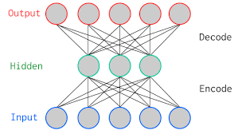
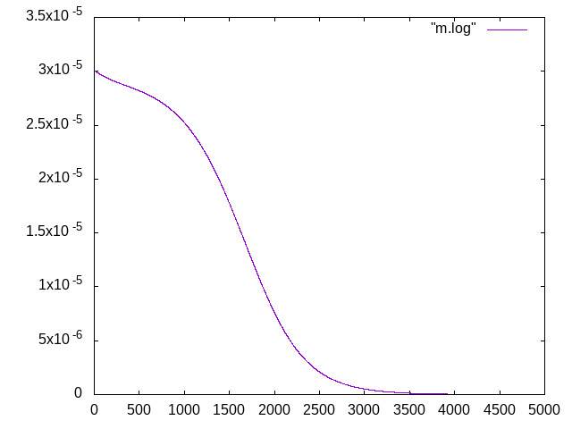

## Cours

### Deep learning par la pratique

##### Christophe Cerisara

(Appuyez sur "p" / "s" pour l'audio)

---

## Objectifs du cours

- Premier cours d'une série future sur le deep learning
- Point de vue programmation / expérimental
- Progression guidée par l'analyse des problèmes

---

## A qui s'adresse ce cours ?

- A des personnes sachant (un peu) coder (en java)
- Notions basiques de maths: dérivées, matrices
- Ayant envie de comprendre, par la pratique, les principes du deep learning

---

## Premier cours: contenu

- Implémentation complète d'un modèle de base: l'auto-encodeur
- Expérimentation sur android
- Analyse des résultats / de la méthode

---

## Comment fonctionne ce cours ?

- Pas d'inscription
- Accessible (en HTML) dans votre navigateur internet
- Déplacez-vous comme vous le voulez dans les slides
- Ecouter l'explication audio en cliquant sur "Play" en bas de chaque slide

---

## Comment fonctionne ce cours ?

- Posez-moi vos questions sur le réseau social Mastodon:

https://mastodon.etalab.gouv.fr/@cerisara

---

## Premier cours: prérequis

- Il vous faut:
  - Un PC avec java-android installé (cf. ci-dessous)
  - Un smartphone Android, connecté via usb au PC
- Je vous explique dans la suite comment tout faire sous Ubuntu-18+ mais vous pouvez adapter à d'autres OS


## Notes Virtualbox

- Vous pouvez installez Ubuntu-20 dans virtualbox pour suivre ce cours
- Mais parfois, il est très difficile de contrôler votre smarphone via usb depuis Virtualbox; je vous recommande donc plutôt de ne pas utiliser de virtualisation.

---

## Setup Ubuntu

- Supposons donc que vous ayez un Ubuntu fraichement installé:

- Installez un compilateur pour Android:
```
   sudo apt-get install android-sdk
```

- C'est tout ! Vous n'avez besoin de rien d'autre !

---

## Auto-encodeur

<div class="container">

<div class="col">



</div>

<div class="col">

- Compresse un vecteur et le regénère
- noeuds = réels
- connections = 2 matrices

</div>

</div>

---

## Auto-encodeur

- C'est un modèle qui prend en entrée un vecteur `$X=[X_i]_{1\leq i\leq n} \in R^n$`
- Puis applique une transfo linéaire $W\cdot X$
- Puis applique un [rectified linear](https://fr.wikipedia.org/wiki/Fonction_d%27activation) $Z=Relu(W\cdot X)$
  - `$Relu(X) = [relu(X_i)]_{1\leq i\leq n}~~~ X_i\in R$`
  - `$relu(X_i>0) = X_i$` sinon `$=0$`

---

## Auto-encodeur

- Compresse l'entrée $X$ en un (petit) vecteur $Z$ (encodeur)
- Regénère un vecteur $Y$ à partir de $Z$ (décodeur)
  - 1 couche: $Y = V\cdot Z$
- L'erreur est la différence entre $X$ et $Y$:
`$$L(X,Y) = (Y-X)^T (Y-X) = \sum_i (Y_i-X_i)^2$$`

---

## Auto-encodeur

- On veut optimiser cette erreur: minimum de `$L$` ?
  - On ne peut pas calculer la fonction dérivée à cause du relu
- Algo: descente de gradient stochastique
  - Calcul de la dérivée (gradient) `$\nabla_{W,V} L(X,Y)$` en chaque point $(X,Y)$
  - Modifie $W,V$ dans le sens inverse du gradient:
`$W_{t+1} = W_t - \epsilon \frac{\partial L(X,Y)}{\partial W}$`
  - On itère

---

## Auto-encodeur

- L'erreur est:
`$$L(X,Y) = \sum_i (\sum_j V_{i,j} Z_j - X_i)^2$$`
- Calculez son gradient par rapport à `$V_{a,b}$`
- La réponse est sur le slide suivant !

---

## Auto-encodeur

- Son gradient par rapport à `$V_{a,b}$` est:
`$$\frac {\partial L} {\partial V_{a,b}} = 2 (Y_a-X_a) Z_b $$`

---

## Auto-encodeur

- L'erreur est:
`$$L(X,Y) = \sum_i (\sum_j V_{i,j} relu(\sum_k W_{j,k} X_k) - X_i)^2$$`
- Calculez son gradient par rapport à `$W_{a,b}$`
- La réponse est sur le slide suivant !

---

## Auto-encodeur

- Gradient non-nul ssi `$\sum_k W_{j,k} X_k>0$`:
`$$L(X,Y) = \sum_i (\sum_j V_{i,j} \sum_k W_{j,k} X_k - X_i)^2$$`
- Donc
`$$\frac {\partial L} {\partial W_{a,b}} = 2\sum_i V_{i,a} X_b (Y_i - X_i) $$`

---

## Auto-encodeur

- Maintenant, nous pouvons implémenter et entraîner un Auto-Encodeur
- Nous allons construire un compresseur audio (une sorte de mp3):
    - Le son viendra du micro de votre smartphone
    - Un Auto-Encodeur apprendra à compresser l'audio

---

## Compression audio

- On va enregistrer 4 secondes d'audio à 16kHz 16bits
- Le son est codé comme une suite de $16000*5=80000$ entiers compris entre -32768 et +32768
- On découpera cette suite en 500 séries de 160 entiers ( = 10 millisecondes)
- On divise chaque entier par 32000 pour avoir des réels à peu près entre -1 et +1
- Ceci est notre vecteur $X$, de dimension 160

---

## Compression audio

- donc $dim(X)=160$ et on choisit de compresser d'un facteur 16, donc $dim(Z)=10$
- Combien de paramètres doit-on apprendre ?
- (réponse slide suivant)

---

## Compression audio

- Les paramètres = matrices $W$ et $V$
- La matrice $W$ a $160*10=1600$ paramètres
- Idem pour la matrice $V$
- Donc notre Auto-Encodeur a 3200  paramètres

---

## Appli Android

- L'appli Android à développer est quasi-prête; téléchargez-la et décompressez-la
```
wget https://olki.loria.fr/dlmooc.tgz
tar zxvf dlmooc.tgz
```
- Puis compilez-la
```
cd dlmooc
./build.sh
```
- Et installez-la sur votre smartphone
```
adb install out/app.apk
```


## Autoriser ADB

- Sur votre smartphone, il vous faut:
    - Autoriser l'installation des applications "unsecure"
    - Autoriser "adb debugging": souvent dans les options "developper": pressez 7 fois la version de android dans les paramètres

---

## Appli Android

- Vous pouvez exécuter cette appli sur votre téléphone
- En appuyant sur le bouton, l'appli enregistre 4 secondes d'audio
- Votre travail: implémenter l'apprentissage de l'Auto-Encodeur
- Tout se passe dans src/fr/dlmooc/dlaudio/Dlaudio.java

---

## Appli Android

- La boucle d'apprentissage est déjà prête: méthode trainModel(); lisez bien cette méthode:
    - les valeurs de $W$ et $V$ sont modifiées par "petits pas"
    - On itère pendant un certain nombre d'*epochs*
- Mais les 2 méthodes calcGradW et calcGradV sont vides: écrivez-les !

---

## Analyse du training

- Exécutez votre programme
- la valeur de $L$ s'affiche en haut: notez sa valeur finale
- La courbe de $L$ est dessinée: environ combien de temps faut-il pour ce nombre d'itérations ?

---

## Analyse du training

- Vous devriez voir une courbe comme celle-ci:



---

## Courbe de loss

- Montre l'évolution de l'erreur pendant le training
- Elle doit diminuer !

---

## Aller plus loin (optionnel)

- Modifier le code (très simple !) pour que le training ne se fasse plus seulement sur 1/100e de secondes, mais sur les 4 secondes qui ont été enregistrées
    - Combien de temps faut-il pour apprendre ?
    - Le loss décroît-il toujours jusque zéro ?


## Accélérer le training

- 1- Optimiser les calculs des gradients : enlever tous les calculs redondants
- 2- Calcul parallèle matriciel --> sur GPU (on le fera en python)
- 3- Il vaut mieux faire beaucoup moins d'epoch (une seule suffit) pour pouvoir traiter plus de sons différents
- 4- Pour cela, capturer le son suivant pendant le training

---

## Améliorer la vitesse d'apprentissage

- Essayer d'autres valeurs du *Learning rate*
    - $\epsilon$ dans les équations
    - LR dans le code
- C'est l'un des hyper-paramètres les plus importants !

---

## Améliorer le loss final

- Il faudra augmenter la *capacité* du modèle (nb de paramètres)
    - En ajoutant des couches (des matrices + Relu)
    - Mais il faut recalculer les gradients ??!
- Prochain cours: dérivation automatique et *chain rule* !

---

## Aller plus loin (optionnel)

- Modifier le code (difficile) pour écouter le son regénéré par l'Auto-Encodeur

---

## Vos retours

- SVP, envoyez-moi vos commentaires, avis, sur Mastodon:

https://mastodon.etalab.gouv.fr/@cerisara

#### Merci !

